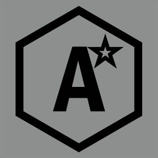

# AStar Engine

  AStar Engine is a CUDA Raytracing engine using OpenGL. The engine is being developed as I learn ray tracing concepts.

 Dependencies:
 - GLFW
 - GLAD
 - KHR

  Controls:
  WASD - movement
  X - Enable raytracing
